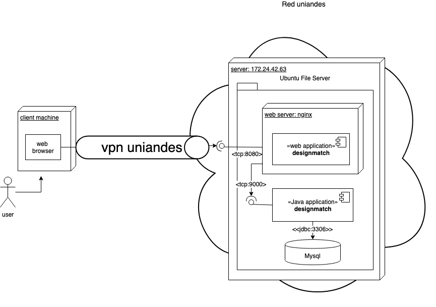
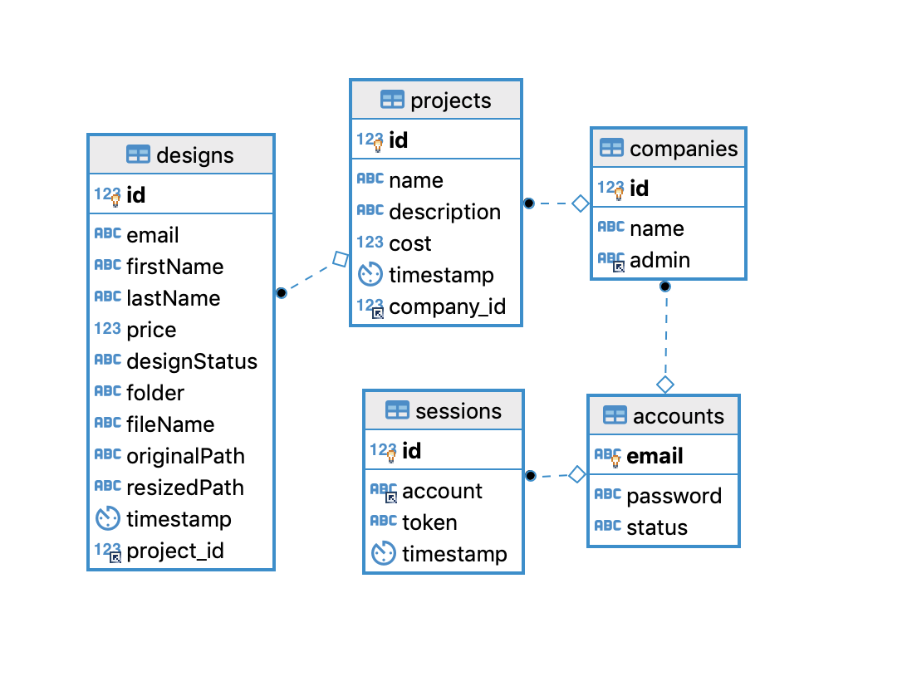
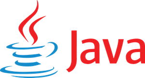
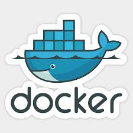

# Grupo14 - Proyecto 1

## Autores

| Nombres                           | Correo                          |
|-----------------------------------|---------------------------------|
| Ruben Dario Fernandez Cardona     | rd.fernandez@uniandes.edu.co    |
| Juan Camilo Colmenares Rocha      | jc.colemenares@uniandes.edu.co  |
| Diego Andrés Torres               | da.torres58@uniandes.edu.co     |

### Contenido
- Generalidades de Arquitectura e Infraestructura.
- Modelo de datos y diagrama E-R.
- Tecnologias de desarrollo.
- Frameworks, librerias y herramientas.
- Despliegue en Amazon Web Services.
- Otras guias y herramientas.
- Troubleshooting

### Generalidades de Arquitectura e Infraestructura.

- **Diagrama de despliegue:**
    
    La aplicación web corre en un servidor dentro de una red privada de la Universidad de los Andes por lo que hay que acceder a través de una VPN, el usuario usando un navegador web ingresa a la aplicación que está alojada en una maquina con ubuntu server de 4 nucleos, 8 GB de memoria RAM  y 40 GB  de disco duro, probablemente HDD. Se usó una aplicación java autocontenida y en el frontend se desarrollo una SPA. 

    La base de datos en MySQL es accedida únicamente desde el servicio de backend de la aplicacion. se usa un servidor web ligero llamado nginx que adicional es proxy reverso y balanceador de carga, (en la aplicación actualmente se usa solo como webserver y proxy reverso). 

    <!--  -->
    


### Modelo de datos y Diagrama E-R.

- **Diagrama E-R:**
    
    El diagrama Entidad Relacion de la aplicacion es el siguiente.
    
    <!--  -->
    

    Como entidades principales, se ilustran la compañías, proyectos y diseños que se pueden gestionar en el sitio web. Sin embargo, es necesario tener en cuenta el uso de entidades de soporte como el manejo de sesiones, de cuentas y de status en los diseños. 

### Tecnologias base.

| Backend   | Frontend  | Database   |
|-----------|-----------|------------|
| | | |

- Java 8: Se escogió este lenguaje de programacion por su facil curva de aprendizaje e integracion con otros sistemas.
- Html5, CSS3 y JS(ES6): Por ser las tecnologias bases esenciales en el desarrollo de aplicaciones web client-side.
- Mysql: por su facilidad de configuracion y uso.

### Frameworks, librerias y herramientas.

| Nginx    | Docker | PlayJava  | ReactJs   | Trello    | Slack |
|-----------|-----------|-----------|-----------|-------|-------|
||  | | | | |

- **Nginx:** como web server y proxy reverso.
- **Docker:** para realizar la distribucion en componentes dockerizados, especificamente el servicio web.
- **PlayJava:** framework de desarrollo moderno y agil para Java, usa un thread/proceso por cada CPU core y es non-blocking I/O.
- **ReactJs:** Su facilidad de desarrollo, aprendizaje y basado en componentes reutilizables.
- **Trello:** Como herramienta KANBAN para llevar un orden en las tareas de desarrollo.
- **Slack:** para la comunicacion entre el equipo.


### Despliegue en Amazon Web Services

#### Servicios utilizados de AWS

| EC2   | EBS   | RDS   | SES   |
|-------|-------|-------|-------|
 | | | |

| VPC   |  Elastic IP  | Route 53    |
|-------|--------------|-------------|
| | | |

- Amazon EC2
- Amazon Elastic Block Store (EBS)
- Amazon Relational Database Service (RDS)
- Amazon Simple Email Service (SES)
- Amazon Virtual Private Cloud (VPC)
- Amazon Elastic IP
- Amazon Route 53


#### Consideraciones previas.

- Debe existir un servicio de base de datos (RDS) y un servicio de mensajeria (SES), configure las credenciales de acceso en el archivo `backend/conf/prod.conf`
- En la maquina remota suponiendo `echo $HOME` = `/home/ubuntu` y los siguientes directorios creados:
---
    ~/
    ├── nginx.conf  # nginx config file.
    ├── app         # backend application folder.
    ├── web         # web aplication folder.
    └── data        # data folder (FileSystem).
---

#### Proceso de despliegue

1. Copie el contenido de la carpeta build del frontend en `/home/ubuntu/web`

2. Copie el archivo zip generado por la aplicacion de backend en `/home/ubuntu/app` y descomprima el archivo zip.

3. Ejecute el servidor web nginx con la configuracion de produccion ubicada en `/home/ubuntu/nginx.conf`.
    
    ```bash
    docker run --name webserver --restart always  \
        -v /home/ubuntu/nginx.conf:/etc/nginx/nginx.conf:ro \
        -v /home/ubuntu/web/:/usr/share/nginx/html/:ro -d --network host  nginx
    ```

4. Ubíquese en el directorio `bin/` de la aplicacion de backend y ejecute el comando:

    ```bash
    nohup bash designmatch -Dconfig.resource=prod.conf &
    ```

    Ésto corre una instancia de la aplicacion en el puerto `9001` o lo que se tenga configurado en el archivo `backend/conf/prod.conf` pero no estará disponible si se reinicia la maquina.

### Otras guias y herramientas.

- Documento [especificacion del backend](backend/README.md).
- Documento [especificacion del frontend](frontend/README.md).

### troubleshooting

* Si se encuentra que la maquina no tiene expuestos los puertos necesarios para conectarse por http etc, configure el firewall:

```bash
sudo ufw status verbose
sudo ufw allow ssh
sudo ufw enable
sudo ufw allow http
sudo ufw allow https
sudo ufw allow 3306
````
