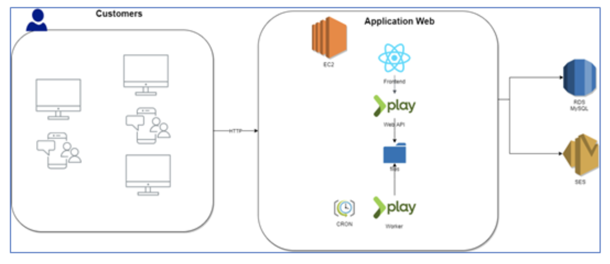
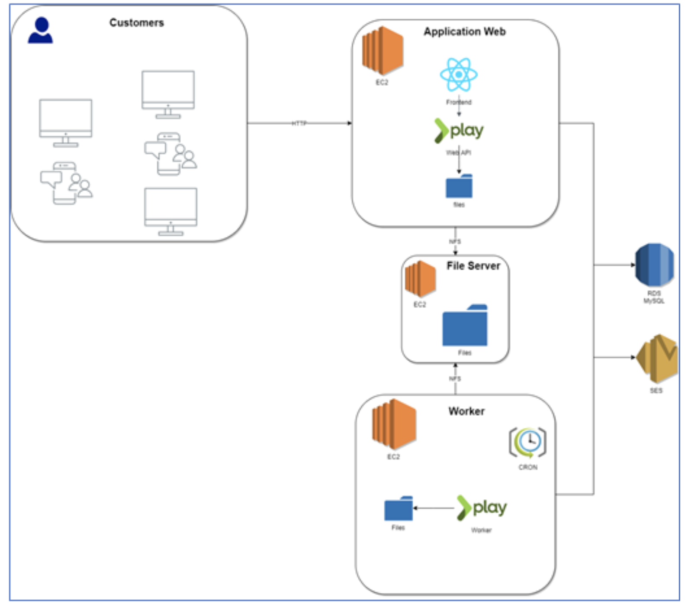
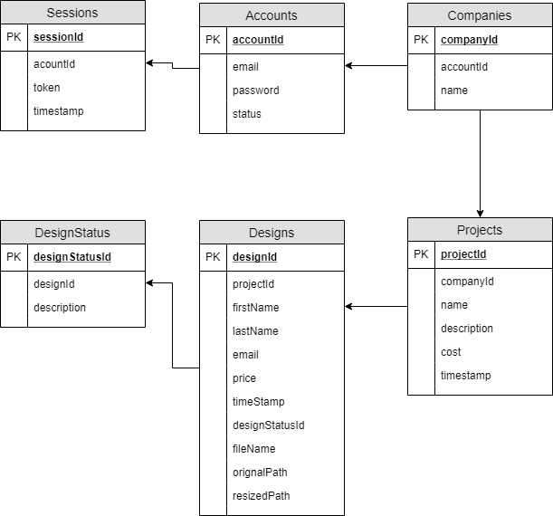

# Grupo14 - Proyecto 1 - Entrega 3 (En progreso.)

## Autores

| Nombres                           | Correo                          |
|-----------------------------------|---------------------------------|
| Ruben Dario Fernandez Cardona     | rd.fernandez@uniandes.edu.co    |
| Juan Camilo Colmenares Rocha      | jc.colemenares@uniandes.edu.co  |
| Diego Andrés Torres               | da.torres58@uniandes.edu.co     |

## Contenido
- [Descripcion de la Arquitectura](#descripcion-de-la-arquitectura).
- [Consideraciones de desarrollo](#consideraciones-de-desarrollo).
- [Servicios y despliegue en AWS](#servicios-y-despliegue-en-aws).
- [Consideraciones de costos](#consideraciones-de-costos).
- [Troubleshootings](#troubleshootings).
- [Otras guias y herramientas](#otras-guias-y-herramientas).


## Descripcion de la Arquitectura.
---

La aplicacion se despliega utilizando servicios cloud de AWS, el más común de ellos es **EC2 (Elastic Cloud Compute)** para la gestion de las máquinas virtuales donde serán instalados los componentes.

A continuacion se presentaran 4 modelos de despliegue diferentes [A..D] en donde todos usan el servicio de mensajeria **SES (Simple Email Service)** de Amazon y los modelos de despliegue A, B y C comparten el servicio de base de datos relacional **RDS (Relational Database Service)** con PostgreSQL y El modelo D es el unico que utiliza  utiliza el servicio  *// TODO*  para la base de datos no Relacional.

Particularmente en el modelo A los elementos principales que son la **appweb**, el **worker** y el **storage** se encuentran en la misma máquina, en una instancia __t2.micro__ con una AMI de __Ubuntu Server 18.04 64-bit (x86)__.

Para el modelo B se utilizan 3 instancias diferentes de una instancia __t2.micro__ con la AMI __Amazon Linux 2 AMI 64-bit (x86)__.

Para el modelo C se utiliza una maquina __t3.nano__ con una AMI __Amazon Linux 2 AMI 64-bit (x86)__ y se espera que sea mas facil observar los cambios en el numero de instancias.

Para el modelo D *// TODO*


- **Modelo de Despliegue A:**

    El modelo de despliegue A, es accedido por los clientes a través de un sitio web mediante protocolo HTTP. Toda la aplicación, salvo el correo electrónico y la base de datos, está desplegada en una sola máquina virtual, tanto la aplicación web (Frontend + Backend), repositorio de archivos y aplicación background de worker. La base de datos se encuentra independientemente desplegado como base de datos como servicio y el cliente SMTP también se encuentra desplegado como servicio. 

    <!--  -->
    


- **Modelo de Despliegue B:**

    El modelo de despliegue B, es accedido por los clientes a través de un sitio web mediante protocolo HTTP. La aplicación web (Frontend + Backend) se encuentra desplegada en una máquina virtual, el repositorio de archivos se encuentra en otra máquina virtual independiente y el worker background se encuentra ejecutándose en otra máquina virtual independiente. Para gestionar los archivos se realiza una comunicación por NFS. La base de datos se encuentra independientemente desplegado como base de datos como servicio y el cliente SMTP también se encuentra desplegado como servicio. 

    <!--  -->
    


- **Modelo de Despliegue C:**

    <!--  -->
    <!---->


- **Modelo de Despliegue D:**

    <!--  -->
    <!---->

### Modelo de datos y diagrama E-R.

- **El diagrama de Informacion de la aplicacion es el siguiente:**
    
    <!--  -->
    

    Como entidades principales, se ilustran la compañías, proyectos y diseños que se pueden gestionar en el sitio web. Sin embargo, es necesario tener en cuenta el uso de entidades de soporte como el manejo de sesiones, de cuentas y de status en los diseños. 

- **El diagrama de Entidad-Relacion:**

    <!--  -->
    

    Esta es el diagrama de ER de la aplicacion y las tablas que existenten actualmente para la base de datos Relacional.
    
> *nota: el diagrama ER fue generado con la herramienta DBeaver*
    
## Consideraciones de desarrollo.
---

### Tecnologias principales utilizadas.

| Backend   | Frontend  | Relational Database   |
|-----------|-----------|------------|
| | | |

- **Java 8+** Se escogió por su popularidad y ser bien conocido, la amplia comunidad que lo soporta y la integracion con otros sistemas.
- **Html5, CSS3 y ES6** Por ser las tecnologias base de las aplicaciones web no *server side*.
- **PostgreSQL** Porque facilita trabajar con procesos concurrentes.


### Frameworks, librerias y herramientas.
| Nginx    | Docker | PlayJava  | ReactJs   | Trello    | Slack |
|-----------|-----------|-----------|-----------|-------|-------|
||  | | | | |

- **Nginx:** Es nuestro webserver, tambien puede usarse como proxy reverso o balanceador de carga.
- **Docker:** Para la distribucion de sofware en componentes, especificamente el *webserver* de nginx.
 **Play/Java:** Framework de desarrollo moderno y agil para Java, usa un thread por cada CPU y es non-blocking I/O.
- **ReactJs:** Framework Javascript de rapido aprendizaje y desarrollo, su capacidad de reutilizar componentes hace el proceso de desarrollo mucho mas agil.
- **Trello:** Como herramienta *Kanban* para registro de las tareas de desarrollo.
- **Slack:** Para la comunicacion entre el equipo, facilita dividir los diferentes temas en categorias y compartir archivos, etc.


## Servicios y despliegue en AWS
---

### Servicios utilizados de AWS utilizados principalmente.
| EC2   | SES   | RDS   |
|-------|-------|-------|
 | | |

- **Amazon EC2 (Elastic Compute Cloud)** El servicio para gestionar las instancias de las maquinas virtuales de amazon, usan el servicio [AMI](https://docs.aws.amazon.com/AWSEC2/latest/UserGuide/AMIs.html) (Amazon Machine Images)
- **Amazon SES (Simple Email Service)** *// TODO*
- **Amazon RDS (Relational Database Service)** *// TODO*


### Otros servicios adicionales de AWS utilizados.
| VPC   |  Elastic IP  | EBS   |
|-------|--------------|-------|
| | | |

- **Amazon EBS (Elastic Block Store)** Es un servicio que viene adicional con EC2 y gestiona el SSD o HHD drive segun sea el caso.
- **Amazon VPC (Virtual Private Cloud)** Servicio por defecto de AWS para gestionar la configuracion de la red en AWS.
- **Amazon Elastic IP** Servicio para asignar una ip estatica a una instancia de *EC2* o a un balanceador de carga. 


### Despliegue en AWS

#### Consideraciones previas al despliegue.

- Debe existir previamente al depsliegue de la **appweb** y del **worker**, un servicio RDS con PostgreSQL, un servicio SES con o sin configuracion de SandBox y un servicio de base de datos no relacional *// TODO*.

- Configure las credenciales de los servicios en el archivo `backend/conf/prod.conf`

- En la instancia de Amazon EC2 suponiendo que la variable `$HOME` es igual a `/home/ec2-user/` deben existir los siguientes directorios y archivos :

    ---
        ~/
        ├── nginx.conf  # nginx config file.
        ├── app         # backend application folder.
        └── web         # web aplication folder.        
    ---

> *nota: Cambie el folder `/home/ec2-user/` por `/home/ubuntu/` para AMIs basadas en Ubuntu.*

#### Proceso de despliegue

1. Copie el contenido de la carpeta `build` del frontend en `/home/ec2/web`

2. Ejecute el servidor web nginx con la configuracion de produccion ubicada en `/home/ec2/nginx.conf`.
    
    ```bash
    docker run --name webserver --restart always  \
            -v /home/ec2-user/nginx.conf:/etc/nginx/nginx.conf:ro \
            -v /home/ec2-user/web/:/usr/share/nginx/html/:ro -d --network host  nginx
    ```
    
3. Copie el archivo .zip generado por la aplicacion de backend en `/home/ec2-user/app` y descomprima el archivo zip. 

4. Estando ubicado en `$HOME` ejecute el servicio de backend con el comando:

    ```bash
    nohup bash designmatch -Dconfig.resource=prod.conf &
    ```

    Ésto corre una instancia de la aplicacion en el puerto `9000` o lo que se tenga configurado en el archivo `backend/conf/prod.conf` pero no estará disponible si se reinicia la maquina.

> *nota: Verifique la existencia del programa **nohup**, de no existir instalelo con `sudo yum install nohup` en sistemas basados en CentOS o `sudo apt-get install nohup` para aquellos basados en Ubuntu.*

## Consideraciones de costos
---
### Tipos de instancias a utilizar.
| Instancia | CPU virtual* | Créditos por hora de CPU | Memoria (GiB) | Almacenamiento | Rendimiento de red (Gbps) |
|-----------|---|-------|-------|----------|--------------------|
| t2.nano	| 1	| 3     | 0,5   | Solo EBS | Bajo               |
| t2.micro  | 1	| 6     | 1     | Solo EBS | De bajo a moderado |
| t3.nano	| 2 | 6     | 0,5   | Solo EBS | Hasta 5            |
| t3.micro	| 2 | 12    | 1     | Solo EBS | Hasta 5            |
| t3.small	| 2 | 24    | 2     | Solo EBS | Hasta 5            |
| t3.medium | 2 | 24    | 4     | Solo EBS | Hasta 5            |
| t3.large  | 2 | 36    | 8     | Solo EBS | Hasta 5            |

#### Costo del servicio Amazon EC2
| tipo instancia    | costo hora/USD| costo dia/COP |
|-------------------|---------------|-------------- |
|t2.nano            | $0,0058	    | $478,43       |
|t2.micro           | $0,0116	    | $956,86       |
|t3.nano 	        | $0,0052	    | $428,94       |
|t3.micro 	        | $0,0104	    | $857,88       |

#### Costo serviocio Amazon RDS
| tipo instancia    | costo hora/USD| costo dia COP     |
|-------------------|---------------|-------------------|
|db.t3.micro        | $0.017	    | $1.402,30         |
|db.t3.small	    | $0.034	    | $2.804,59		    |
|db.t3.medium	    | $0.068	    | $5.609.184,00     |
|db.t3.large	    | $0.136	    | $11.218.368,00    |

> *nota: Datos obtenidos del 2019-10-15 para la region `US East (N. Virginia)`*

## Troubleshootings
---

1.  **las instancias de EC2 no exponen los puertos por defecto.**

    Si se encuentra con que la maquina virtual no tiene expuestos los puertos necesarios para conectarse por http o cualquier otro puerto TCP por ejemplo, puede instalar el sofware *ufw* o activarlo si ya se encuentra instalado y configure cada puerto de forma manual como se demuestra en el siguiente script :

    ```bash
    $ sudo ufw status verbose

    $ sudo ufw allow ssh
    
    $ sudo ufw allow http

    $ sudo ufw enable
    ```

## Otras guias y herramientas
---
1. guia especificacion del backend ([Guia backend](backend/README.md)).
2. guia especificacion del frontend ([Guia frontend](frontend/README.md)).


