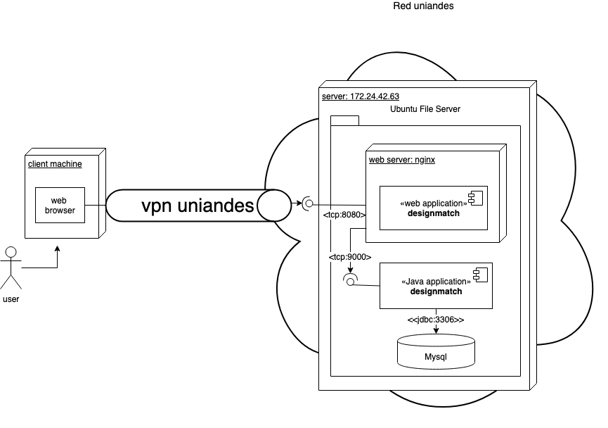
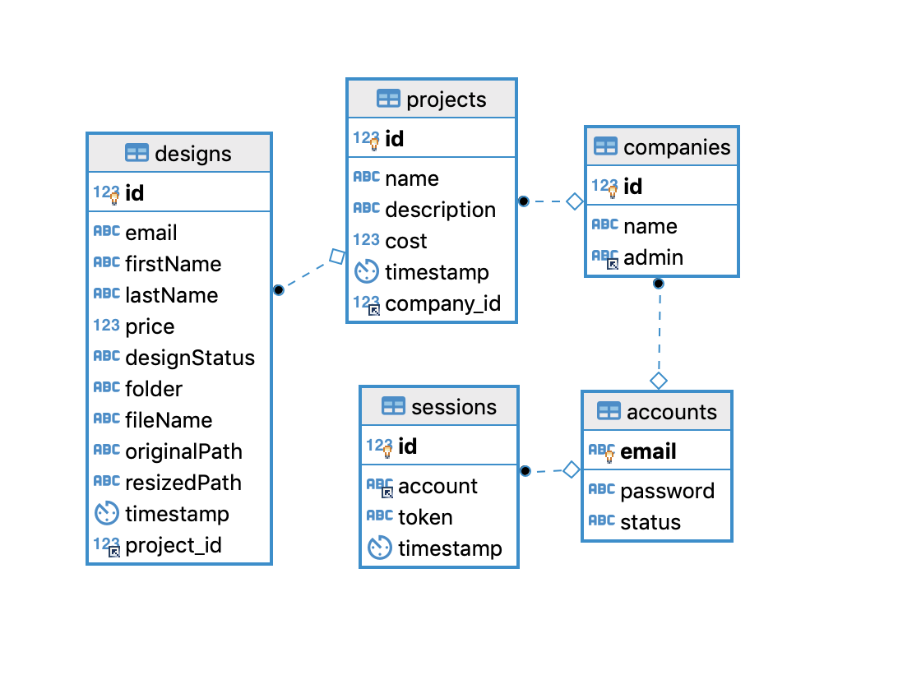
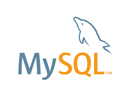
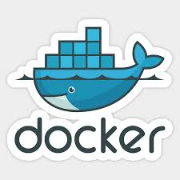
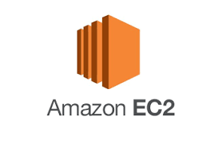

# Grupo14 - Infraestructura y Arquitectura.

### Contenido
- Generalidades de Arquitectura e Infraestructura.
- Modelo de datos y diagrama E-R.
- Tecnologias de desarrollo.
- Frameworks, librerias y herramientas.


#### Generalidades de Arquitectura e Infraestructura.

- Diagrama de despliegue:
    
    La aplicación web corre en un servidor dentro de una red privada de la Universidad de los Andes por lo que hay que acceder a través de una VPN, el usuario usando un navegador web ingresa a la aplicación que está alojada en una maquina con ubuntu server de 4 nucleos, 8 GB de memoria RAM  y 40 GB  de disco duro, probablemente HDD. Se usó una aplicación java autocontenida y en el frontend se desarrollo una SPA. 

    La base de datos en MySQL es accedida únicamente desde el servicio de backend de la aplicacion. se usa un servidor web ligero llamado nginx que adicional es proxy reverso y balanceador de carga, (en la aplicación actualmente se usa solo como webserver y proxy reverso). 

    <!--  -->
    


#### Modelo de datos y Diagrama E-R.

- Diagrama E-R:
    
    El diagrama Entidad Relacion de la aplicacion es el siguiente.
    
    <!--  -->
    

    Como entidades principales, se ilustran la compañías, proyectos y diseños que se pueden gestionar en el sitio web. Sin embargo, es necesario tener en cuenta el uso de entidades de soporte como el manejo de sesiones, de cuentas y de status en los diseños. 

#### Tecnologias base.

| Backend   | Frontend  | Database   |
|-----------|-----------|------------|
| | | |

#### Frameworks, librerias y herramientas.

| Docker    | PlayJava  | ReactJs   | Trello    | Slack |
|-----------|-----------|-----------|-----------|-------|
| | | | | |

#### Servicios utilizados de AWS

| VPC   | Route 53  | EC2   | EBS   | RDS   | SES   |
|-------|-----------|-------|-------|-------|-------|
| | | | | | |


- Amazon Virtual Private Cloud (VPC)
- Amazon Route 53
- Amazon EC2
- Amazon Elastic Block Store (EBS)
- Amazon Relational Database Service (RDS)
- Amazon Simple Email Service (SES)


posiblemente
- Amazon Elastic Compute Cloud / 

| Elastic IP    |
|---------------|
| |


## En construccion:

### Despliegue en AWS

1. Teniendo `$HOME = /home/ubuntu` debe existir el siguiente grupo de carpetas:
---
    ~
    ├── infra           # infraestructure resources.
    |    └── README.md  # this file.
    ├── app             # binaries application folder.
    ├── web             # web application folder.
    └── data            # data folder.
---

2. Ejecute el servicio de base de datos de alguna de las siguientes maneras:

- Despliegue de base de datos en docker (simplificado):

    ejecutar:

> `docker run --name mysql-db --restart always -e MYSQL_ROOT_PASSWORD=root -e MYSQL_DATABASE=dev  -p 3306:3306 -d mysql`


---


3. Despliegue de servidor web.

> `docker run --name webserver --restart always -v /home/ubuntu/infra/nginx/nginx.conf:/etc/nginx/nginx.conf:ro -v /home/ubuntu/web/:/usr/share/nginx/html/:ro -d --network host  nginx`

#### ejecucion de la aplicacion backend en el server


unzip target/universal/designmatch-1.0.0.zip \  
bash designmatch-1.0.0/bin/designmatch
bash designmatch-1.0.0/bin/designmatch -Dhttp.port=1234 -Ddb.default.password=moresecret -Dpidfile.path=other/RUNNING_PID

```
9. Otros:

- configurar un firewall local:
sudo ufw status verbose
sudo ufw allow ssh
sudo ufw enable
sudo ufw allow http
sudo ufw allow https
sudo ufw allow 3306


\<\< [volver](../README.md)