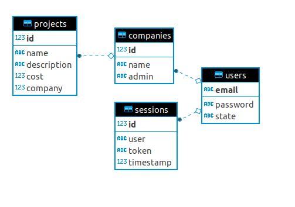

# Grupo14 - Infraestructura y Arquitectura.

### Contenido
- Generalidades de Arquitectura.
- Generalidades de Infraestructura.
- Modelo ER.
- Lenguajes de programacion.
- Frameworks.
- Librerias y Herramientas.

#### Modelo ER.

El modelo de Entidad Relacion de la aplciacion es el siguiente:

#### Lenguajes de programacion utilizados.

| Backend                      | Frontend                       | Database                              |
|------------------------------|--------------------------------|---------------------------------------|
| | ||

#### Frameworks.

| PlayJava                          | ReactJs                              |
|-----------------------------------|--------------------------------------|
|      |       |

#### Librerias y Herramientas.

| Docker                           | JWT                        | Trello                           |
|----------------------------------|----------------------------|----------------------------------|
| | | |

\<\< [volver](../README.md)